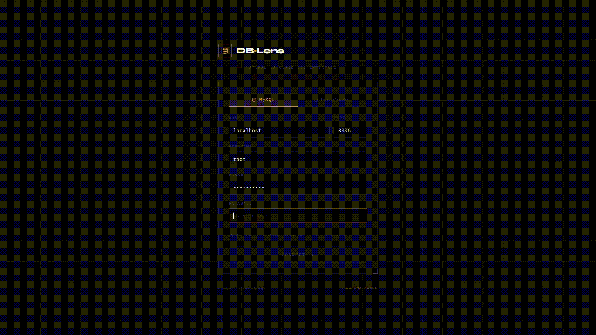

# DBLens — Natural Language Database Copilot

> Query any MySQL or PostgreSQL database in plain English. No SQL required.

DBLens is a local-first developer tool that sits between you and your database. Connect it to any MySQL or PostgreSQL instance, type a question, and get back validated SQL, live query results, and schema-aware context — all without writing a single line of SQL yourself.

Built with a full-stack AI pipeline: React frontend, FastAPI backend, Google Gemini for SQL generation, SQLGlot for safety validation, sentence-transformers + FAISS for schema retrieval, and a self-correcting auto-repair loop that fixes broken SQL before it ever reaches you.

---

## Demo



> _Connect your local DB → ask questions → get results. Works with any MySQL or PostgreSQL database._

---

## Architecture

```
Browser (React)
    │  fetch /connect · /query
    ▼
FastAPI Backend
    ├── DB Connector         MySQL · PostgreSQL drivers
    ├── Schema Extractor     SHOW TABLES + DESCRIBE → structured JSON
    ├── FAISS Embedder       sentence-transformers → top-k table retrieval
    ├── Gemini API           schema context + conversation history → raw SQL
    ├── SQLGlot Validator    AST parse — SELECT-only enforcement
    └── Executor             run query → error → repair_sql → retry (max 3)
```

Full architecture diagram: [`/assets/architecture.png`](./assets/architecture.png)

---

## Features

**Core pipeline**
- Connect to any local or remote MySQL or PostgreSQL database with standard credentials
- Schema extraction on connect — reads all tables, columns, types, and primary keys
- Natural language → SQL via Google Gemini with full schema context in the prompt
- Conversation memory — follow-up questions work. "Now filter by last month" understands the previous query
- Auto-repair loop — if Gemini generates broken SQL, the error is sent back to the model for self-correction, retrying up to 3 times before surfacing the error

**Safety**
- SQLGlot AST validation blocks every non-SELECT statement at the parser level — not string matching
- `DROP`, `DELETE`, `UPDATE`, `INSERT` are rejected before they touch the executor
- Credentials stored in localStorage with a lazy initializer — no passwords persisted between sessions

**Schema RAG**
- On connect, each table is embedded using `all-MiniLM-L6-v2` and stored in a FAISS index
- On every query, the question is embedded and the top-5 semantically relevant tables are retrieved
- Only those tables are sent to Gemini — reduces prompt size, cuts token cost, improves accuracy on large databases

**Frontend**
- Schema explorer sidebar with expandable table tree and real-time search
- Chat interface with user/assistant bubbles, SQL code blocks, and paginated results table
- Responsive layout — sidebar collapses on mobile
- Credential persistence — form pre-filled on page reload, only password re-entered

---

## Tech Stack

| Layer | Technology |
|-------|-----------|
| Frontend | React 18, Tailwind CSS, Vite |
| Backend | FastAPI, Python 3.11+ |
| AI | Google Gemini API (`gemini-1.5-flash`) |
| Embeddings | `sentence-transformers` — `all-MiniLM-L6-v2` |
| Vector search | FAISS (`faiss-cpu`) |
| SQL safety | SQLGlot |
| Databases | MySQL (`mysql-connector-python`), PostgreSQL (`psycopg2`) |

---

## Getting Started

### Prerequisites

- Python 3.11+
- Node.js 20.19+
- A running MySQL or PostgreSQL database (local or remote)
- A [Google Gemini API key](https://aistudio.google.com/apikey) — free tier works

### 1. Clone the repo

```bash
git clone https://github.com/yourusername/dblens.git
cd dblens
```

### 2. Backend setup

```bash
cd backend
python -m venv venv

# macOS / Linux
source venv/bin/activate

# Windows
venv\Scripts\activate

pip install -r requirements.txt
```

Create a `.env` file in the `backend/` folder:

```env
GEMINI_API_KEY=your_gemini_api_key_here
```

Start the backend:

```bash
uvicorn main:app --reload
```

The API is now live at `http://localhost:8000`. Visit `http://localhost:8000/docs` for the interactive Swagger UI.

### 3. Frontend setup

```bash
cd frontend
npm install
npm run dev
```

Open `http://localhost:5173`.

### 4. Connect your database

Fill in your database credentials on the connection screen and click **Connect**. DBLens will:

1. Open a live connection to your database
2. Extract the full schema
3. Build a FAISS embedding index for smart table retrieval
4. Drop you into the chat interface

---

## Usage Examples

```
"Show all users who signed up in the last 7 days"
"Which products have stock below 10?"
"List the top 5 customers by total order value"
"Show unpaid invoices older than 30 days"
"How many orders were placed per month this year?"
```

Follow-up questions work because conversation history is passed as context:

```
"Show the top 10 members by number of issues"
→ "Now filter those to members from the Engineering department"
→ "Sort by most recent issue date"
```

---

## Project Structure

```
dblens/
├── backend/
│   ├── main.py               FastAPI app — /connect, /query, /health routes
│   ├── connector.py          MySQL + PostgreSQL driver abstraction
│   ├── schema_extractor.py   Table/column extraction + schema_to_text()
│   ├── embedder.py           FAISS index build + top-k retrieval
│   ├── sql_generator.py      Gemini prompt builder + repair_sql()
│   ├── validator.py          SQLGlot AST-based SELECT enforcement
│   ├── executor.py           Query runner + 3-attempt auto-repair loop
│   └── requirements.txt
└── frontend/
    └── src/
        ├── context/
        │   └── DBContext.jsx           Global connection + schema state
        ├── hooks/
        │   ├── useDBConnection.js      Async connect logic + localStorage persistence
        │   ├── useChat.js              useReducer chat state + auto-scroll ref
        │   └── useSchema.js            useMemo schema filtering
        ├── reducers/
        │   └── chatReducer.js          ADD_MESSAGE · SET_LOADING · SET_ERROR
        └── components/
            ├── CredentialsForm.jsx
            ├── WorkspacePage.jsx
            ├── SchemaTree.jsx
            ├── ChatWindow.jsx
            └── QueryInput.jsx
```

---

## How the Auto-Repair Loop Works

When Gemini generates SQL that fails execution, the error isn't surfaced to the user immediately. Instead:

```
Generate SQL (Gemini)
    ↓
Validate (SQLGlot) — not a SELECT? → repair prompt → retry
    ↓
Execute against DB — error? → send error + broken SQL back to Gemini
    ↓
Gemini generates corrected SQL
    ↓
Validate + execute again
    ↓
Repeat up to 3 attempts → then surface error
```

This mirrors the pattern used in production AI SQL tools like Vanna.ai. In practice it handles the most common failure modes: wrong column names, missing table aliases, dialect-specific syntax issues.

---

## How Schema RAG Works

Sending 50 tables to an LLM on every query is expensive and inaccurate. DBLens uses FAISS to solve this:

1. **On `/connect`** — each table is converted to a text representation (`Table: orders\nColumns: id, user_id, amount...`) and embedded using `sentence-transformers`
2. **On `/query`** — the user's question is embedded using the same model
3. **Cosine similarity search** in the FAISS index returns the 5 most semantically relevant tables
4. **Only those tables** are included in the Gemini prompt

For a database with 50 tables, this reduces the prompt by ~80%, cuts token cost, and improves SQL accuracy because the model isn't distracted by irrelevant schema context.

---

## Limitations

- Read-only by design — only `SELECT` queries are allowed
- Active connections are in-memory — reconnect after server restart
- Free Gemini API tier has rate limits — switch to `gemini-1.5-flash-8b` for higher throughput
- SQLite not yet supported (MySQL and PostgreSQL only)

---

## Contributing

Issues and PRs are welcome. The codebase is intentionally un-abstracted — every file does one clear thing, making it easy to extend.

---

## License

MIT
